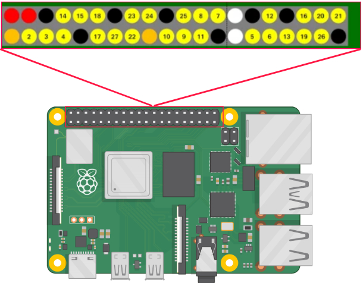

# GOPIO
A simple gpio controller package for raspberrypi, written in golang.

### Installation

```bash
go get github.com/polarspetroll/gopio
```

#### basic example

```go
package main

import (
  "log"

  gpio "github.com/polarspetroll/gopio"
)
func main() {
  g5, err := gpio.New(5, gpio.OUT) // first export a pin
  if err != nil {
    // handle error ...
  }

  err = g5.SetHigh() // change pin value to high
  if err != nil {
    // handle error ...
  }

  err = g5.SetLow() // change pin value to low  
  if err != nil {
    // handle error ...
  }

  err = g5.ChangeValue(gpio.HIGH) // manual value manipulation
  if err != nil {
    // handle error ...
  }
}
```

### Pin Numbering
this package uses physical pin numbering.


