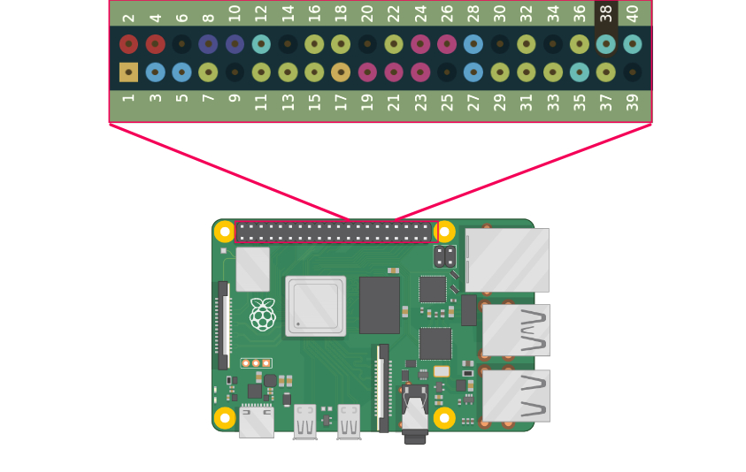

# GOPIO
A simple gpio controller package for raspberrypi, written in golang.

- 🎇 New feature:
  - added wiringpi functions which it is written in C and it is much more compatible, efficient and faster. The wiringpi part uses CGO feature of golang so wiringpi library is required if you wish to use it.


  > the documentation for this package will be available very soon.

### Installation

```bash
sudo apt-get install wiringpi

go get github.com/polarspetroll/gopio
```

##### [More Examples](https://github.com/polarspetroll/gopio/tree/main/examples)

### Pin Numbering
this package uses physical pin numbering.(both wiringpi functions and default functions)


