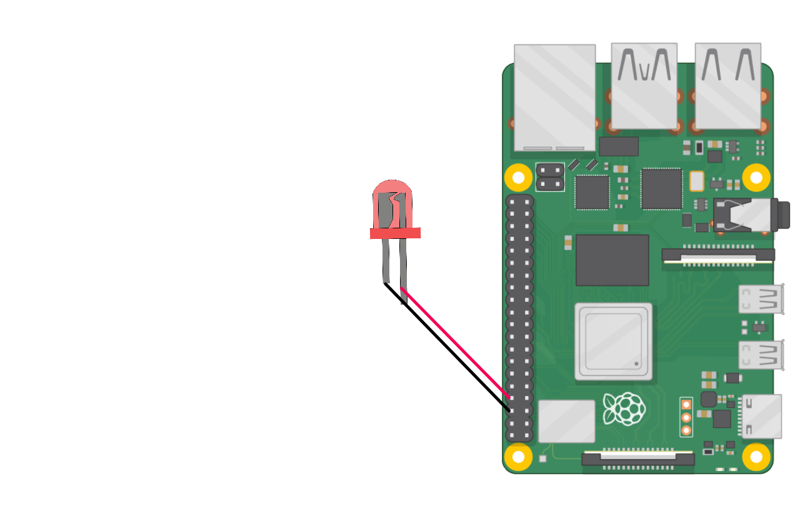

# Blink

```go
package main

import (
        "time"

        "github.com/polarspetroll/gopio"
)

func main() {
        gopio.GopioSetUp() //initial function for wiringpi
        gp40 := gopio.PinMode(8, gopio.OUT) // physical pin numbering (BCM 14, Physical 8)
        for {
                gp40.DigitalWrite(gopio.HIGH)
                time.Sleep(100 * time.Millisecond)
                gp40.DigitalWrite(gopio.LOW)
                time.Sleep(100 * time.Millisecond)
        }
}

```

##### Wiring

<div align="left">

</div>
