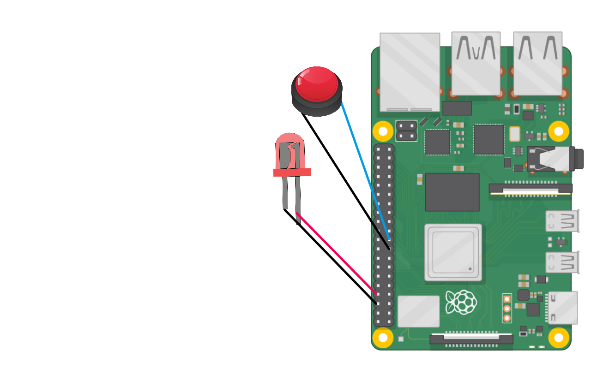

# Button listener


```go
import (
   "log"
   "sync"


   "github.com/polarspetroll/gopio"
)

var wg sync.WaitGroup  

func main() {
   btn, err := gopio.New(19, gopio.IN) // button
   if err != nil {
     log.Fatal(err)
   }
   g8, err := gopio.New(8, gopio.OUT) // led
   if err != nil {
           log.Fatal(err)
   }

   defer g8.Close()
   defer btn.Close()

   wg.Add(1)
   go func(){btn.OnValueChange(g8, Cback)}()
   log.Println("Waiting for button press")
   wg.Wait()
}

func Cback(g gopio.Pin) {
        g.SetHigh()
}

```

##### Wiring

<div align="left">

</div>
